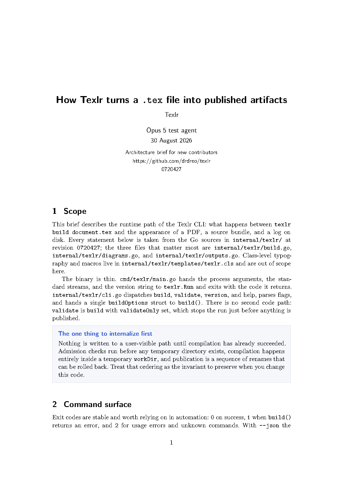
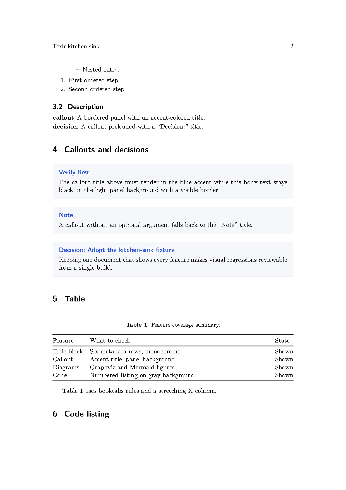
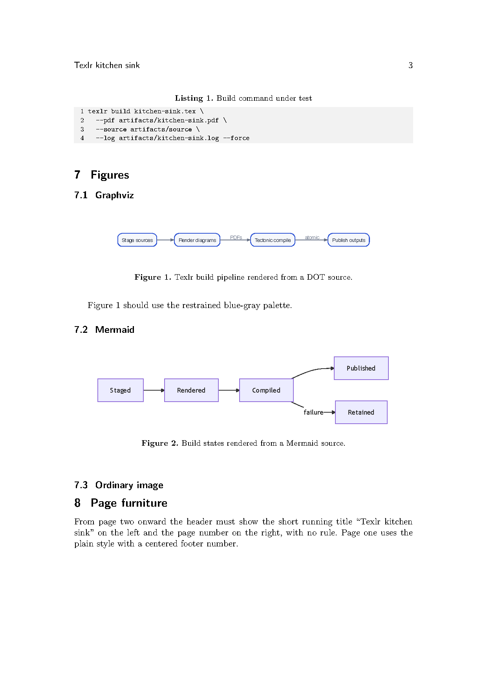

# Texlr

Texlr turns agent-authored LaTeX into polished PDF handoffs and self-contained,
editable source bundles. It is a local Go CLI with a Nix-packaged document
toolchain.

> **Status:** early preview. The command and template contract may still change.

## Why Texlr

- LaTeX is the canonical source—no Markdown conversion layer.
- HgbArticle-derived typography keeps title text high-contrast while reserving restrained color for callouts and diagrams.
- Graphviz and Mermaid diagrams render from helper macros before compilation.
- PDF, source bundle, and log destinations are independently controlled.
- Existing outputs are never replaced unless `--force` is explicit.
- Failures retain the complete log and staging directory for agent debugging.
- Human-readable output is the default; `--json` provides a stable agent API.

## What it looks like

<p align="center">
  
  
  
</p>

Left to right: the title block and a callout, decision panels with a booktabs
table, and a code listing with rendered Graphviz and Mermaid figures. All
three pages were authored and built end-to-end by coding agents using the
bundled skill — no hand-tuned LaTeX.

## Get going

1. **Install** Texlr and its document toolchain into your profile:

   ```sh
   nix profile add github:drdreo/texlr
   ```

2. **Teach your agent.** Link the [bundled skill](#agent-skill) into your
   agent's skill directory. From then on, asking for a handoff, implementation
   report, or architecture brief as a local document routes through Texlr;
   asking to post one to Slack, Notion, or a PR stays native Markdown.

3. **Or write one yourself.** Author a `.tex` with `\documentclass{texlr}`
   ([full example](examples/handoff.tex)), then:

   ```sh
   texlr validate handoff.tex
   ```

   ```sh
   texlr build handoff.tex --pdf out/handoff.pdf --source out/handoff-source --log out/handoff.log
   ```

   You get a polished PDF, an editable self-contained LaTeX bundle, and the
   full build log. The sections below cover every option in detail.

## Install with Nix

Run directly from a checkout:

```sh
nix run . -- version
```

Install into your profile:

```sh
nix profile add github:drdreo/texlr
```

The package includes Texlr, Tectonic, Graphviz, Mermaid CLI, and Ghostscript
for PDF normalization. Linux builds also include Chromium. On macOS, Mermaid
rendering uses an installed Google Chrome, Chromium, or Brave Browser; Texlr
discovers standard application paths.
Tectonic populates its local TeX cache on the first build, which requires a
network connection.

For development:

```sh
nix develop
go test ./...
go run ./cmd/texlr version
```

### Visual regression fixture

[`testdata/kitchen-sink/kitchen-sink.tex`](testdata/kitchen-sink/kitchen-sink.tex)
exercises every class feature — title metadata, callouts, decisions, tables,
listings, math, Graphviz, Mermaid, and plain images — in one document. Build it
and rasterize each page for screenshot comparison:

```sh
nix develop -c ./scripts/screenshot-test.sh
```

The PDF and per-page PNGs land in `artifacts/kitchen-sink/`. After changing
`texlr.cls` or diagram rendering, rebuild and compare the pages against a
known-good copy.

## Agent skill

Texlr ships an [Agent Skills](https://agentskills.io/) skill that teaches agents
to turn plans, project findings, and delivery summaries into validated handoff
artifacts. Install it globally for Pi and compatible local harnesses:

```sh
mkdir -p ~/.agents/skills
ln -s "$PWD/skills/texlr-handoff" ~/.agents/skills/texlr-handoff
```

New Pi sessions discover the skill automatically when the request mentions a
handoff, implementation report, architecture brief, research report, delivery
summary, or polished plan. Use `/skill:texlr-handoff` to force-load it.

## Write a handoff

Create a normal `.tex` document using the bundled `texlr` class:

```tex
\documentclass{texlr}

\title{Authentication migration handoff}
\author{Delivery agent}
\date{\today}
\project{Atlas API}
\status{Ready for review}
\repository{https://github.com/example/atlas}
\revision{a1b2c3d}

\begin{document}
\maketitle

\section{Outcome}
The migration is ready for integration.

\begin{callout}[Verify first]
Rotate the staging credentials before enabling production traffic.
\end{callout}

\begin{figure}[ht]
  \centering
  \graphviz[width=0.82\linewidth]{diagrams/architecture.dot}
  \caption{Resulting authentication boundary.}
\end{figure}

\begin{figure}[ht]
  \centering
  \mermaid[width=0.9\linewidth]{diagrams/cutover.mmd}
  \caption{Cutover sequence.}
\end{figure}

\end{document}
```

Diagram paths are relative to the directory containing the input document.
Texlr follows active `\input` and `\include` files while ignoring comments and
verbatim-style examples. It renders each source beside itself as `<source>.pdf`
inside the staged source bundle. Use normal `\includegraphics` for PNG, JPEG,
or PDF images.
Generate data charts with your preferred plotting tool before invoking Texlr.

See [`examples/handoff.tex`](examples/handoff.tex) for a complete example.

## Build

```sh
texlr build handoff.tex \
  --pdf ./artifacts/handoff.pdf \
  --source ./artifacts/handoff-source \
  --log ./artifacts/handoff.log
```

To replace any existing destination:

```sh
texlr build handoff.tex \
  --pdf ./artifacts/handoff.pdf \
  --source ./artifacts/handoff-source \
  --log ./artifacts/handoff.log \
  --force
```

The source directory contains the original `.tex` tree, bundled `texlr.cls`,
original diagram sources, rendered diagram PDFs, and `texlr-manifest.json`.

Output paths must be distinct and must not contain one another. With `--force`,
Texlr replaces file outputs only when they are regular files. It replaces a
non-empty source directory only when it contains a Texlr manifest, preventing a
mistyped path from recursively deleting an unrelated project. Prepared outputs
are committed together and rolled back if publication fails.

## Validate

`validate` renders declared diagrams and runs a full temporary Tectonic compile,
but does not publish a PDF or source bundle:

```sh
texlr validate handoff.tex --log ./artifacts/validate.log
```

Validation catches missing inputs, missing tools, diagram failures, and fatal
LaTeX syntax/asset errors. It intentionally does not fail on stylistic warnings
such as overfull boxes.

## Agent-facing JSON

```sh
texlr build handoff.tex \
  --pdf /absolute/path/handoff.pdf \
  --source /absolute/path/handoff-source \
  --json
```

Successful and failed results include stable artifact paths. Failed builds also
include `workDir`; Texlr leaves that directory intact so an agent can inspect
intermediate files. Errors use a short `kind`, including `invalid_input`,
`output_exists`, `diagram_failed`, `latex_failed`, and `output_failed`.

## Authoring contract for agents

1. Write direct LaTeX with `\documentclass{texlr}`.
2. Keep the document and all assets under one document directory.
3. Use `\graphviz[<graphicx options>]{path.dot}` and
   `\mermaid[<graphicx options>]{path.mmd}`.
4. Use ordinary figure environments for captions and labels.
5. Run `texlr validate` before `texlr build`.
6. Always pass explicit absolute output paths in automation.
7. Add `--force` only when replacing the named artifacts is intentional.
8. On failure, inspect the reported log and retained build directory.

## Trust model

Texlr is designed for trusted local agents and trusted document sources. It
does not enable TeX shell escape itself, but it executes Graphviz and Mermaid
against declared assets and is not an isolation boundary. Do not use it to
compile hostile documents without an external sandbox.

## Licensing

The Go CLI is MIT licensed. The bundled document class contains adapted
CC BY 4.0 material and is distributed under that license. See
[`THIRD_PARTY_NOTICES.md`](THIRD_PARTY_NOTICES.md) for attribution and scope.
No HagenbergThesis or FH Upper Austria logos or institutional branding are
included.
